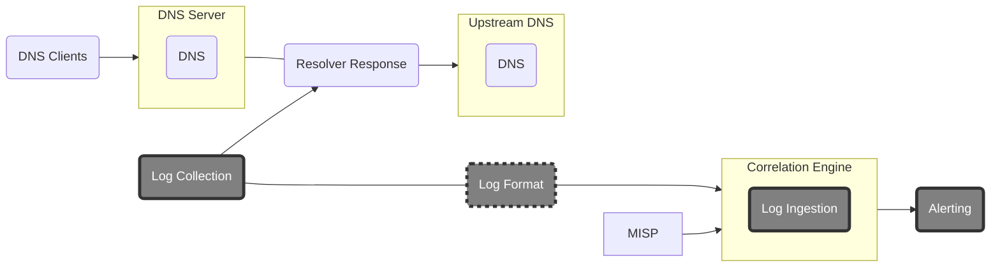

# pDNSSOC

*Leveraging MISP indicators via a pDNS-based infrastructure as a poor man’s SOC.*

# Introduction

The pDNSSOC project is aimed at organisations, e-infrastructures and federations, interested in leveraging threat intelligence to prevent, detect or investigate malicious connections.
It focuses on providing a minimalistic design and modular deployment.
It correlates Passive DNS (pDNS) data with network-based indicators provided by a connected [MISP](https://www.misp-project.org) instance.

A key goal of pDNSSOC is to allow easy adoption by all service providers, regardless of their maturity level and security effort available.

# Service components

pDNSSOC is divided in the following discrete parts (grey filled nodes):
1. Log collection
2. Correlation with threat intelligence
3. Alerting

## 1. Log Collection

This element provides DNS data to the [Correlation Engine](./docs/correlation_engine.md). There is a plethora of passive DNS probes and DNS log collectors available with various collection approaches and output formats. In order to support as many deployment scenarios as possible, we have to agree on a [Common Log Format](./docs/log_format.md).

## 2. Correlation Engine

The [Correlation Engine](./docs/correlation_engine.md) is the main software component of the pDNSSOC architecture.
Its design is simple.

Inputs:
*  **DNS logs**
*  **Network-based indicators** from a connected MISP instance

Outputs:
* **Alerts** sent to pre-defined recipient(s) (supported formats: JSON, email)
* **pDNS data** forwarded to other projects relying on pDNS analysis (Opt-in).

Multiple [Correlation Engines](./docs/correlation_engine.md). may be deployed to cover many pDNS sources (scale-out model).
The [Correlation Engine](./docs/correlation_engine.md) is aimed at being standalone and easily deployable.

## 3. Alerting

This component represents a human layer receiving the alerts from the Correlation Engine.
The intent is to provide the analyst(s) with as much contextual information possible to allow them to follow up as appropriate with the originating pDNS source.

Alerts may be sent to a simple email address or ingested by a complex SIEM, based on the chosen deployment model.
Different [Correlation Engines](./docs/correlation_engine.md) can send alerts to the same recipients.

# Deployment options

# References

* https://securityintelligence.com/how-to-use-passive-dns-to-inform-your-incident-response/

* https://www.covert.io/research-papers/security/Exposure%20-%20Finding%20malicious%20domains%20using%20passive%20dns%20analysis.pdf
