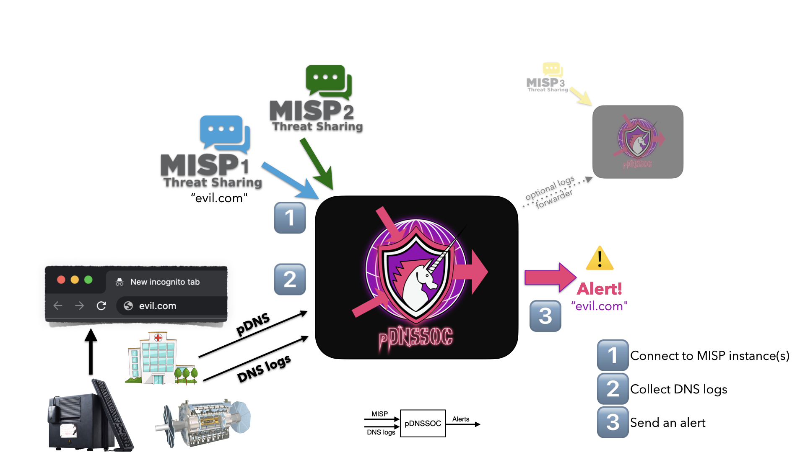
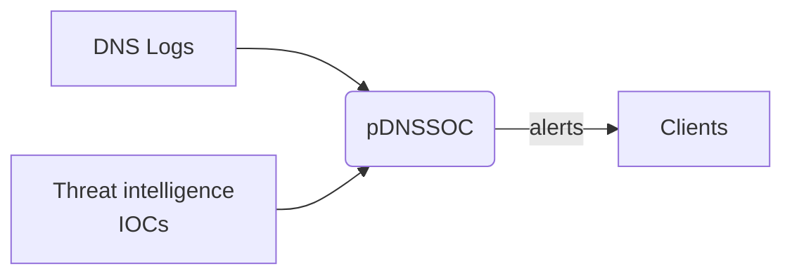

# pDNSSOC

*Correlating DNS logs with threat intel from MISP as a poor man’s SOC.*

## Background & motivation

In the Research & Education (R&E) sector, "defending as a global community" is a crucial strategy.
This involves having the hability to produce and share relevant threat intelligence, and the capability to leverage it accross the entire sector.

Large campuses and research labs typically have dedicated security teams and adequate skills. But even there, deploying and operating a Security Operations Center (SOC) is a hard problem to solve.
In addition, a significant part of the R&E sector has a relatively low maturity level on threat intel, and no or limited security staff and expertise.

pDNSSOC provides a turn-key solution to both detect and respond to security incidents.


## What is pDNSSOC?

**pDNSSOC is aimed at providing SOC capabilities in under 10 sec on a fresh VM.**

pDNSSOC is a lightweight component correlating DNS logs with threat intelligence aiming at communities with mixed levels of security expertise.

Basically:
1. A central security team is available
2. The central team operate or has access to one or more MISP instances
3. The central team deploys and operates a pDNSSOC server
4. Community members send DNS logs to the pDNSSOC server
5. The central team receives security alerts about matches between DNS queries made by the client and malicious domains sources from MISP

pDNSSOC logs can be used to:
- **Detect new intrusions from known malicious domains**
- **Identify victims in near-realtime as part of incident response**





### Client side

In order to get quality and well-formatted data for correlation, the DNS log shipping implementation is based on [go-dnscollector](https://github.com/dmachard/go-dnscollector), a lightweight DNS logging collector supporting various log sources (e.g. AF_PACKET, dnstap, log files).

### Server side

Deploying and operating pDNSSOC is expected to require little/no specific expertise beyond basic sysadmin work.
A pDNSSOC instance typically runs on a small VM and can handle large volume of DNS data -- many deployment scenarios are possible.


## Deploying a pDNSSOC server

The intent is to allow pDNSSOC to be used in environment where:
- The clients have very limited time and expertise
- The pDNSSOC operator has security expertise and existing trust relationships with the clients



### Who should deploy a pDNSSOC server?

pDNSSOC operators are typically security teams at NREN CERTs, e-infratructure security teams, regional or national security teams, central teams of distributed projects/organizations, Managed Security Service Providers, etc.


### Deployment

#### Client
A specific collector needs to be installed on the client side to ensure proper formatting and filtering of DNS logs:

##### Steps
1. Install `go-dnscollector`
    ```sh
    curl -LO  "https://github.com/dmachard/go-dnscollector/releases/download/v${GO_DNSCOLLECTOR_VERSION}/go-dnscollector_${GO_DNSCOLLECTOR_VERSION}_linux_amd64.tar.gz" && \
    tar xvf "go-dnscollector_${GO_DNSCOLLECTOR_VERSION}_linux_amd64.tar.gz" && \
    mv go-dnscollector /usr/bin/
    ```
2. Modify the collector config file based on the [client template](files/configuration/dnscollector/client.yml).
3. Start the collector
    ```sh
    go-dnscollector -c client.yml
    ```

#### pDNSSOC server

The main DNS log collection point correlating data with IOCs and producing JSON files ready to be ingested in alerting systems.

##### Requirements

* python3
* supervisor
* superfsmon


##### Steps

1. Install `go-dnscollector`
    ```sh
    curl -LO  "https://github.com/dmachard/go-dnscollector/releases/download/v${GO_DNSCOLLECTOR_VERSION}/go-dnscollector_${GO_DNSCOLLECTOR_VERSION}_linux_amd64.tar.gz" && \
    tar xvf "go-dnscollector_${GO_DNSCOLLECTOR_VERSION}_linux_amd64.tar.gz" && \
    mv go-dnscollector /usr/bin/
    ```
2. Modify the collector config file based on the [server template](files/configuration/dnscollector/server.yml) and place under `/etc/dnscollector/config.yml`
3. Create the required files for storing incoming DNS logs:
    ```sh
    mkdir -p /var/dnscollector/matches
    ```
4. Copy the [postrotate script](files/configuration/dnscollector/postrotate_query.sh) to `/var/dnscollector/postrotate_query.sh`
5. Ensure that the collecting port set in the previous step is accessible.
6. Install `pdnssoc-cli`
    ```sh
    pip install pdnssoc-cli
    ```
7. Modify the pdnssoccli config file based on the [pdnssoccli template](files/configuration/pdnssoccli/pdnssoccli.yml) by adding MISP details.
8. Install `supervisor` tooling
    ```sh
    pip install supervisor superfsmon
    ```
9.  Launch `supervisord` with the config file of the [template](files/configuration/supervisor/supervisord.conf).
    ```ssh
    supervisord -c supervisord.conf
    ```
10. Schedule the following recurring commands (e.g. with crond, timers):
    * Refresh of IOCs:
        ```sh
        pdnssoc-cli -c pdnssoccli.yml fetch-iocs
        ```
    * Run correlation:
        ```sh
        pdnssoc-cli -c pdnssoccli.yml correlate /var/dnscollector/matches/
        ```
11. That's it. Alerts can be found at `/var/dnscollector/alerts`.

##### Docker

All of the previous steps for the server part can be automated using the dockerized pdnssoc version:

1. Install `docker`, `docker-compose` and `git`.
2. Fetch pdnssoc:
    ```sh
    git clone --depth 1 --branch v0.0.2 https://github.com/CERN-CERT/pDNSSOC.git
    ```
3. Go to the `files/docker` directory
4. Populate `pdnssoccli.yml` with MISP server details.
5. Run `docker-compose up`

In case you need to re-build the image, please use the following (after adjusting the tags to match the latest dependency versions):
```sh
cd files/docker
docker build . -t pdnssoc --build-arg GO_DNSCOLLECTOR_VERSION="0.35.0" --build-arg PDNSSOC_CLI_VERSION="v0.0.2" --build-arg SUPERCRONIC_VERSION=
"v0.2.26"
```


## Important directories
* `/var/dnscollector/queries/`: One of the default flows for the receiving dns collector is compressing and storing the unfiltered DNS traffic for future correlation. In this directory you will find multiple archives per day hosting the aggregated received DNS traffic.
* `/var/dnscollector/matches/`: DNS log entries matching the IOC lists defined during ingestion. These files are afterwards enriched with threat intelligence data and stored in `/var/dnscollector/alerts/`.
* `/var/dnscollector/alerts/`: JSON files ready to be ingested in logging and alerting systems (e.g. Opensearch) or consumed by tools to generate notifications.
* `/var/dnscollector/misp_domains.txt`: New-line separated file with malicious domains fetched by MISP servers defined in `/etc/dnscollector/pdnssoccli.yml`. Those are used for DNS request correlation.
* `/var/dnscollector/misp_domains.txt`: New-line separated file with malicious IPs fetched by MISP servers defined in `/etc/dnscollector/pdnssoccli.yml`. Those are used for DNS response correlation.


## FAQ

### Deployment questions and support

#### Can I operate a pDNSSOC server for my local community and pass on the data flow to another security team with access to a better MISP instance?

Yes, **providing trust and privacy issues** have been addressed with all parties.  It is possible to configure a pDNSSOC server as a client for another pDNSSOC server.

Forwarding requires adding another logger in the server dnscollector side:
```yaml
  loggers:
    - name: pdnssoc_forwarder
      dnstap:
        remote-address: pdnssoc_second_server_ip # Modify with the target pdnssoc destination
        remote-port: pdnssoc_server_port
        connect-timeout: 5
        retry-interval: 10
        flush-interval: 10
        tls-support: false
        tls-insecure: false
        server-id: "SERVER_ID" @
        buffer-size: 100
        chan-buffer-size: 65535
    - .... Other loggers....

  routes:
    - from: [ dnstap ]
      to: [ filelogdomains, filelogips, fileall, pdnssoc_forwarder ]
```

#### Is it possible to use multiple MISP instance?
Yes. Just add them in the pdnssoc-cli configuration file.

#### Is it possible to add other DNS server types or input format?

Yes. All of the input implementations listed at the `go-dnscollector` [documentation](https://github.com/dmachard/go-dnscollector/blob/main/docs/collectors.md) are supported by pdnssoc-cli

## Bug reports

Please report issues on [Github](https://github.com/CERN-CERT/pDNSSOC/issues).
