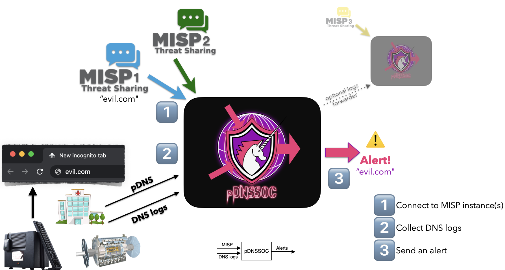

# pDNSSOC

*Correlating DNS logs with threat intel from MISP as a poor man’s SOC.*

## Background & motivation

In the Research & Education (R&E) sector, "defending as a global community" is a crucial strategy.
This involves having the hability to produce and share relevant threat intelligence, and the capability to leverage it accross the entire sector.

Large campuses and research labs typically have dedicated security teams and adequate skills. But even there, deploying and operating a Security Operations Center (SOC) is a hard problem to solve.
In addition, a significant part of the R&E sector has a relatively low maturity level on threat intel, and no or limited security staff and expertise.

pDNSSOC provides a turn-key solution to both detect and respond to security incidents.


## What is pDNSSOC?

**pDNSSOC is aimed at providing SOC capabilities in under 10 sec on a fresh VM.**

pDNSSOC is a a to be a minimalistic component correlating DNS logs with threat intel from a MISP in order to send alert.


pDNSSOC is aimed at communities with mixed levels of security expertise.
Basically:
1. A central security team is available
2. The central team operate or has access to one or more MISP instances
3. The central team deploys and operates a pDNSSOC server
4. Community members send some for of DNS logs to the pDNSSOC server
5. The central team receives security alerts about matches between DNS queries made by the client and malicious domains sources from MISP

pDNSSOC logs can be used to:
- **Detect new intrusions from known malicious domains**
- **Identify victims in near-realtime as part of incident response**





### Client side

There is no actual pDNSSOC client. Simple!
Clients send DNS data by configuring existing services to send data using one of the supported methods:
- Configure their DNS server to log queries and then use syslog
- Configure their DNS server to log queries and the send them over TCP
- Configure their DNS server, network equipment, IDS, Zeek, or any part of their infrastructure to produce pDNS data and send the data over TCP
- Other way to produce and send DNS data can easily be added

### Server side

Deploying and operating pDNSSOC is expected to require little/no specific expertise beyond basic sysadmin work.
A pDNSSOC instance typically runs on a small VM and can handle large volume of DNS data -- many deployment scenarios are possible.


## Deploying a pDNSSOC server

The intent is to allow pDNSSOC to be used in environment where:
- The clients have very limited time and expertise
- The pDNSSOC operator has security expertise and existing trust relationships with the clients


### Who should deploy a pDNSSOC server?

pDNSSOC operators are typically security teams at NREN CERTs, e-infratructure security teams, regional or national security teams, central teams of distributed projects/organizations, Managed Security Service Providers, etc.


### How to deploy and configure a pDNSSOC server?

### VM deployment

1. Get a fresh CENTOS 9 or AlmaLinux 9 (or any binary-compatible system with Red Hat Enterprise Linux 9) VM
2. Install the needed libraries:
```
yum install gem jq rubygems-devel
```
3. Download and install td-agent (fluentd):
```
curl -L https://toolbelt.treasuredata.com/sh/install-redhat-td-agent4.sh | sh
```
4. Download the gem file:
```
curl -o /path/to/download/pdnssoc-VERSION.gem https://rubygems.org/downloads/pdnssoc-VERSION.gem
```
5. Install the rpm:
```
rpm -i pdnssoc-VERSION-RELEASE.noarch.rpm
```
6. Populate the configuration in `/etc/pdnssoc/pdnssoc.conf` with the MISP server(s) details and the alert emails details
7. Use the fluentd config template in `/etc/pdnssoc/td-agent.conf.template` to overwrite or adapt `/etc/td-agent/td-agent.conf`
8. Include the appropriate firewall rules in order to accept incoming traffic:
```
firewall-cmd --zone=public --add-port=5140-5143/tcp --permanent
firewall-cmd --zone=public --add-port=5555/tcp --permanent
firewall-cmd --reload
```
9.Enable timers:
```
sudo systemctl daemon-reload
sudo systemctl enable pdnssoc.timer lookingback.timer misp_refresh.timer
sudo systemctl start pdnssoc.timer lookingback.timer misp_refresh.timer
```

10. Do an initial load of malicious domains from MISP:
```
/bin/bash /usr/local/bin/pdnssoc/misp_refresh.sh
systemctl restart td-agent
```
10. That's it! You can do the following to check that the system is well configured:
```
systemctl list-timers
netstat -putan | grep -E ':(514[0-3]|5555) '
```

Directory structure:
```
/etc/pdnssoc/
├── notification_email.html
├── pdnssoc.conf
└── td-agent.conf.template

/etc/td-agent/
├── misp_domains.txt
├── misp_ips.txt
├── plugin
└── td-agent.conf -> /etc/pdnssoc/td-agent.conf

/var/log/td-agent/
...
├── queries/
├── pdnssoc-alerts
│   └──pdnssoc-buffer/
├── alerts.log
├── pdnssoc_sys.log
└── td-agent.log

/usr/lib/systemd/system/
...
├── lookingback.service
├── lookingback.timer
├── misp_refresh.service
├── misp_refresh.timer
├── pdnssoc.service
└── pdnssoc.timer

```

### Configuration file

The pDNSSOC server configuration file is simple and available at `pdnssoc.conf`.

The configuration files allow to define:
- MISP servers to fetch domains from, including specific `tags` or timeframes
- Define the email resultings from alerts (`from`, `to`, `subject` fields, and SMTP servers details)
- **[Optional]** flag specific VIP pDNSSOC clients in the alerts. These `pdns_client` will have extra visibility in the alerts. This feature is helpful when the server is receiving data from a mixed of sources, to give additional visibility to pDNSSOC clients with many DNS clients behind (e.g a pDNS collector for multiple universities) versus end-user clients.

```
{
    "misp_servers": [
        {
            "url":"https://misp1.myserver.org/",
            "api_key":"API_KEY_1",
            "parameter":"/attributes/restSearch/returnFormat:text/type:domain/"
        },
        {
            "url":"https://misp2.myotherserver.ch/",
            "api_key":"API_KEY_2",
            "parameter":"/attributes/restSearch/returnFormat:text/type:domain/from:2022-01-01/"
        }
    ],
    "alerts_path":"/var/log/td-agent/pdnssoc-alerts/",
    "pdns_client" : {
        "127.0.0.1":
        {
            "name":"Test host",
            "email":"email@address.tld"
        }
    },
    "email" : {
        "from":"pdnssoc-dev@domain.tld",
        "to":"pdnssoc-dev@domain.tld",
        "subject":"[pDNSSOC] Community XYZ alert",
        "server":localhost",
        "port":25
    }

}
```
### Configuring input channels

pDNSSOC relies on `Fluentd` and uses regular expression to match up incoming traffic from clients.
The defaults input paths are configured:
- `TCP/5140`: DNS queries from syslog
- `TCP/5141`: DNS queries from BIND using syslog format send over TCP
- `TCP/5142`: pDNS data from dnstap (https://dnstap.info)
- `TCP/5555`: pDNS data forwarded from another pDNSSOC server

Input channels are defined and configurable at `td-agent.conf`.

## Configuring pDNSSOC clients

### DNS logs via TCP

Sending logs directly from the DNS server over TCP is the recommended input path for pDNSSOC.

For BIND, the solution below involves NO extra package to be installed on the system, NO recompilation of BIND or any extra modules.
It simply relies on a shell script and a BIND logging configuration change:
1. Configure BIND  in `/etc/named/logging.conf`, to log `queries` in a file, for example:
```
# Add a channel to write DNS queries to a log file

     channel queries_file_pdnssoc {
        file "/var/log/named/pdnssoc-queries.log" versions 100 size 2m;
        severity dynamic;
        print-time yes;
    };


category queries { queries_file_pdnssoc; };
```
2. Send the resulting data over TCP to the pDNSSOC server, for example with this shell script:
```
$ mkdir -p  /var/log/named/sender/
$ cat /usr/local/bin/pdns_soc_sender.sh
#!/bin/bash

pdnssoc_server="<ADD_YOUR_pDNSSOC_HOSTNAME_HERE>"
pdnssoc_server_port="5141"


path_logs="/var/log/named/"
path_target="/var/log/named/sender/"


for log_file in $(ls $path_logs | grep -E "pdnssoc-queries.log.[0-9]+")
	do
    mv "$path_logs/$log_file" $path_target
    cat  "$path_target/$log_file" | nc $pdnssoc_server $pdnssoc_server_port -w 10
done

rm -f $path_target/*
```

3. Call the script above on a regular basis with a CRON:

```
$ cat /etc/crontab 
*/5 * * * * root  /usr/local/bin/pdns_soc_sender.sh  &> /dev/null
```
4. Restart/reload involved services where configuration was changed

### DNS logs via rsyslog

Although `syslog` and `rsyslog` would be trivial and convenient options, unfortunately, they result in significant amount of data loss, even over TCP.

For low-load DNS server, where direct TCP is not possible, using `rsyslog`
with the syslog Forwarding Output Module `omfwd` is the recommended solution:
1. Configure BIND  in `/etc/named/logging.conf`, to log `queries` in a facility like `local0`, for example:
```
    channel queries_remote {
        syslog local0;
        severity dynamic;
        print-time yes;
    };

category queries { queries_remote; };
```


3. Configure `rsyslog` to send the logs in `local0.*` to a pDNSSOC server:
```
$ cat /etc/rsyslog.d/01-named.conf 
local0.* action(type="omfwd"
      queue.type="linkedlist"
      action.resumeRetryCount="-1"
      queue.saveOnShutdown="on"
      target="<ADD_YOUR_pDNSSOC_HOSTNAME_HERE>" port="5140" protocol="tcp"
     )
```

4. Restart/reload involved services where configuration was changed

### DNSTap logs

By default, pDNSSOC supports receiving real time DNS logs on `TCP/5142`.
The default format is `dnstap` `RESOLVER_RESPONSE(RR)` data, but other formats can be added by modifying the appropriate regular expression in `/etc/td-agent/td-agent.conf`.

`dnstap`is already compiled and enabled in BIND starting RHEL 8 as well as in most Linux distributions. `BIND` needs to be configured to send `RESOLVER_RESPONSE` (`RR`) data in `named.conf`:
```
...
dnstap {resolver response;} ;
...
```

Additional `dnstap` guidance is available online, including for other OSes and DNS servers, for exemple [here](https://access.redhat.com/documentation/en-us/red_hat_enterprise_linux/8/html/configuring_basic_system_settings/assembly_using-dnstap-in-rhel-8_configuring-basic-system-settings) and [here](https://dmachard.github.io/posts/0001-dnstap-testing/) or [here](https://jpmens.net/2017/09/11/dns-query-response-logging-with-dnstap/).

## FAQ


### Deployment questions and support

#### Can I operate a pDNSSOC server for my local community and pass on the data flow to another security team with access to a better MISP instance?

Yes, **providing trust and privacy issues** have been addressed with all parties. 
It is possible to configure a pDNSSOC server as a client for another pDNSSOC server.
On the *source* pDNSSOC server, edit `/etc/td-agent/td-agent.conf`, uncomment and edit the `## Send data to another pDNSSOC server` section according to your needs:

```
	## Send data to another pDNSSOC server
	#
        <store>
         @type forward
         send_timeout 60s
         recover_wait 10s
         hard_timeout 60s
         <server>
           host myhost.domain.edu
           port 5555
         </server>
        </store>
	#
        #######################
```

#### Is it possible to use multiple MISP instance?
Yes. Just add them in the pDNSSOC configuration file at `/etc/pdnssoc/pdnssoc.conf`.

#### Is it possible to add other DNS server types or input format?

Yes. More input formats and paths can be added simply by editing the `Fluentd` configuration file (typically `/etc/td-agent/td-agent.conf`) with an extra TCP port and the relevant regular expression.
`Fluentd` expects the following fields: `<date>`, `<client>` and `query`.

### Bug reports

Please report issues on [Github](https://github.com/CERN-CERT/pDNSSOC/issues).
