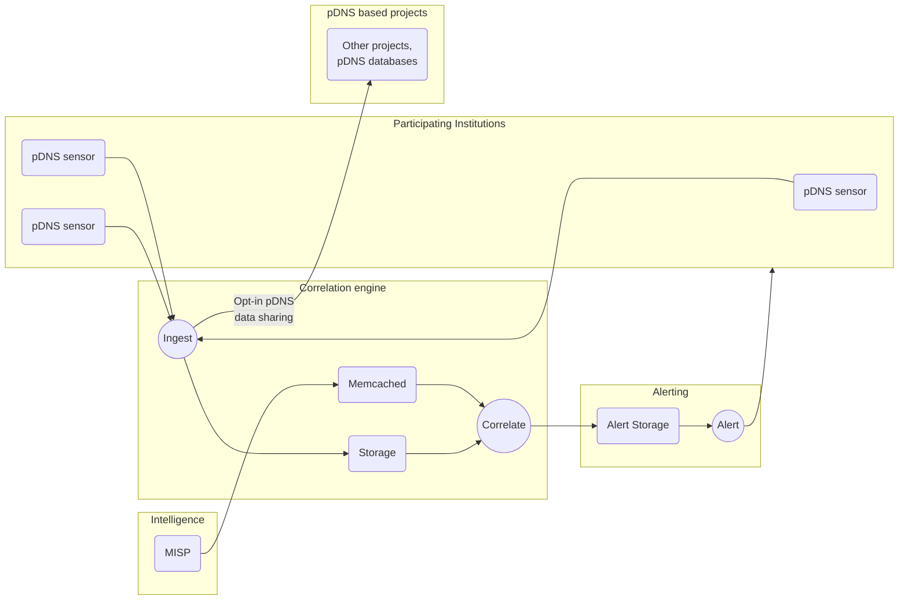

# Correlation Engine

:warning: :construction: WORK IN PROGRESS :construction: :warning:

## Contents

<!-- @import "[TOC]" {cmd="toc" depthFrom=1 depthTo=6 orderedList=false} -->

<!-- code_chunk_output -->

- [Correlation Engine](#correlation-engine)
  - [Contents](#contents)
  - [Building blocks](#building-blocks)
    - [`MISP` Caching implementation](#misp-caching-implementation)
    - [Storage solution](#storage-solution)
    - [Opt-in data pDNS data sharing](#opt-in-data-pdns-data-sharing)
  - [Areas of work - `WIP`](#areas-of-work-wip)
  - [Timeline - `WIP`](#timeline-wip)

<!-- /code_chunk_output -->

## Building blocks

### `MISP` Caching implementation

Attributes are fetched from one or multiple MISP instances and stored in a KV store solution (`Memcached` at the moment) so as to be ready for correlation without putting pressure on the MISP instances

### Storage solution

DNS data is ingested from passive DNS sensors. This is where the relation between originating DNS recursive client and participating institution entity is stored so that alerting is possible.

### Opt-in data pDNS data sharing

Participating institutions will be given the choice to opt-in for pDNS data sharing with other projects that are based on pDNS data analysis.

## Areas of work - `WIP`

- [ ] Storage selection
- [ ] Define whether correlation will also be done for past attributes/DNS logs
- [ ] Define time window for valid MISP attributes
- [ ] Define types of MISP attributes
- [ ] Define different types of DNS logs (DNS Ttraffic above the recursive, passive DNS aggregated logs)
- [ ] Define data flow for pDNS data and Incident response related data

## Timeline - `WIP`

TBD
