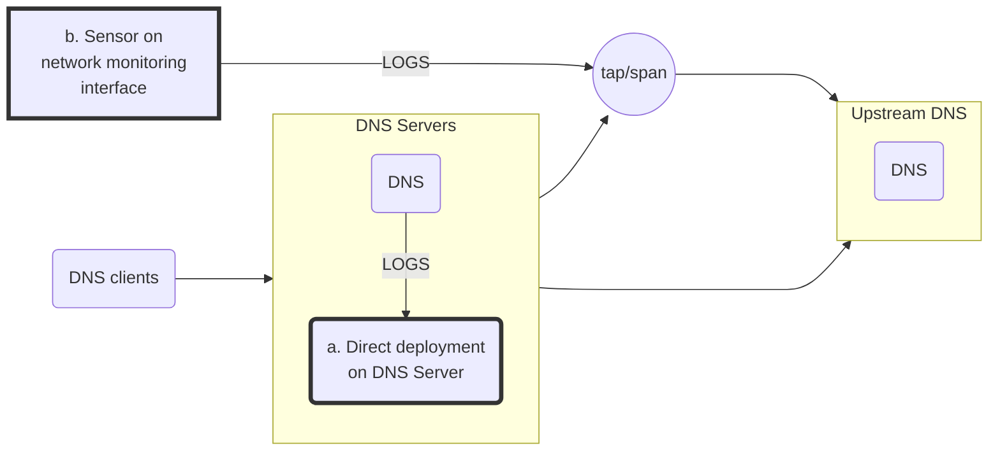

# Log collection

We are currently investigating available open source pDNS sensor and DNS probe solutions to integrate with pDNSSOC. There is a variety of implementations, among them:

* [passivedns](https://github.com/gamelinux/passivedns/)
* [DNSMonster](https://github.com/mosajjal/dnsmonster)
* [gopassivedns](https://github.com/Phillipmartin/gopassivedns) - :warning: Unmaintained :warning:
* [Farsight SIE DNS Sensor](https://github.com/farsightsec/sie-dns-sensor/)
* [go-dns-collector](https://github.com/dmachard/go-dns-collector/)
* DNS data from Bro/Zeek
* [DNSTAP](https://dnstap.info/)

## Sensor deployment

The sensor is installed and operated by the client institute at the resolving servers, collecting only server-to-server traffic between recursive resolvers and authoritative servers:
* No link between people and traffic can be established by [Correlation Engine](./docs/correlation_engine.md).
* Only non-cached traffic is probed by the sensor, significantly reducing the data sent to the [Correlation Engine](./docs/correlation_engine.md).

### Approaches
The sensor can be deployed:
* Directly on the DNS Server host
* On a network monitoring interface

## Collector implementations

### DNSTAP
https://dnstap.info/

* Supported by most of the well-known DNS server implementations
* On some cases (e.g. BIND), it requires rebuilding with specific feature flags
* Offers filtering per message type and streaming using a well defined [Google Protobuf schema](https://github.com/dnstap/dnstap.pb/blob/master/dnstap.proto).
* There are variable tools that can act as DNSTAP Protobuf clients, converting Protobuf messages to the desired format.

### sie-dns-sensor
https://www.farsightsecurity.com/technical/passive-dns/passive-dns-sensor/

* Capturing raw packets from a network interface (can be deployed either on the same host as the DNS server or on a network monitoring interface)
* Widely used and battle tested
* Implementation agnostic
* Packages for Debian, RHEL and FREEBSD
* Protobuf based messages
* Work in progress to have an nmsg to JSON implementation
