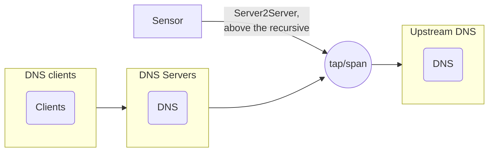

# pDNS sensor

We are currently investigating available open source pDNS sensor solutions to integrate with pDNSSOC. There is a variety of implementations, among them:

* [passivedns](https://github.com/gamelinux/passivedns/)
* [DNSMonster](https://github.com/mosajjal/dnsmonster)
* [gopassivedns](https://github.com/Phillipmartin/gopassivedns) - :warning: Unmaintained :warning:
* [Farsight SIE DNS Sensor](https://github.com/farsightsec/sie-dns-sensor/)
* pDNS(DNS?) data from Bro/Zeek
* DNS logs directly above the recursive (Still not including specific client device information)

## Sensor deployment

The sensor is installed and operated by the client institute at the resolving servers, collecting only server-to-server traffic between recursive resolvers and authoritative servers:
* No link between people and traffic can be established by [Correlation Engine](./docs/correlation_engine.md).
* Only non-cached traffic is probed by the sensor, significantly reducing the data sent to the [Correlation Engine](./docs/correlation_engine.md).